# IBM MQ SSL

## 版本
| 修改时间 | 版本号 |备注|
| --- | --- |---|
| 2019/06/10 16:52:28  | V1.0.1  |新建文档|
## 目录
[toc]
## 注意事项必读
1. **MQ上的SSL密码套件和JAVA的密码套件会不对应名称会有问题,请看文档注意**
2. **队列管理器和通道中的SSL标签记住要相同**


## 资料
[错误信息](https://www-01.ibm.com/support/docview.wss?uid=swg21614686)
[加密套件密码](https://www.ibm.com/support/knowledgecenter/en/SSFKSJ_8.0.0/com.ibm.mq.dev.doc/q113210_.htm)
## 服务器上操作流程
打开软件**IBM Key Management**


### 新建证书库
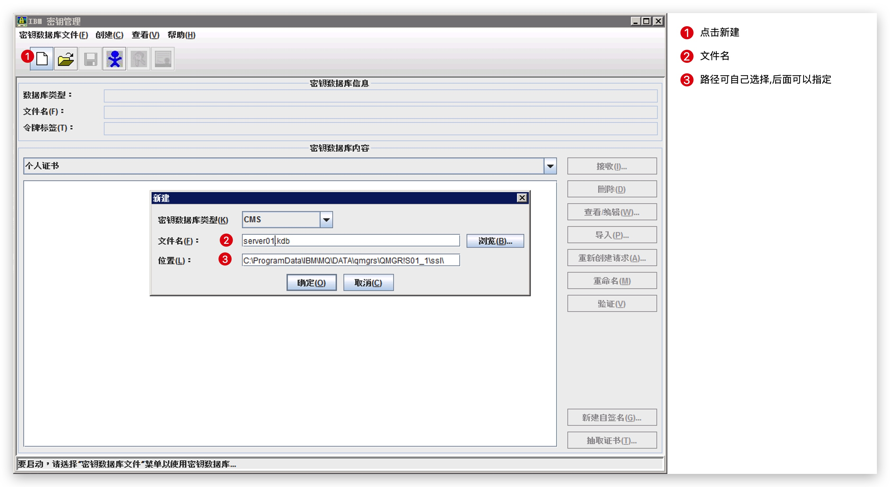
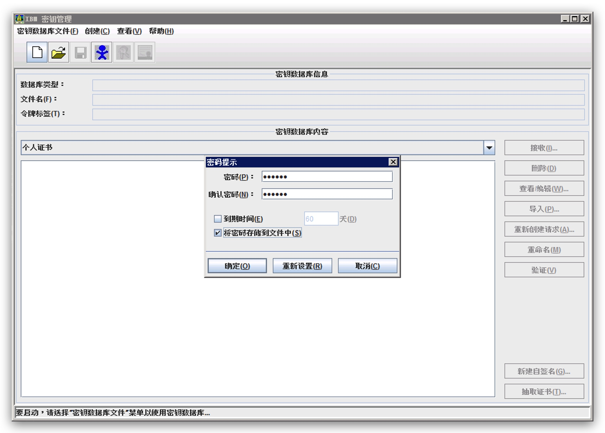
### 创建证书
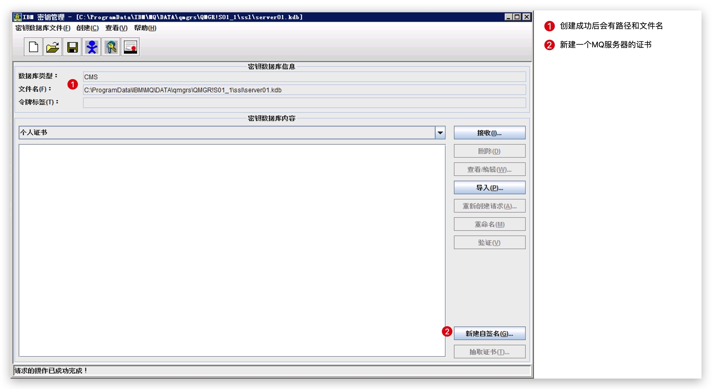
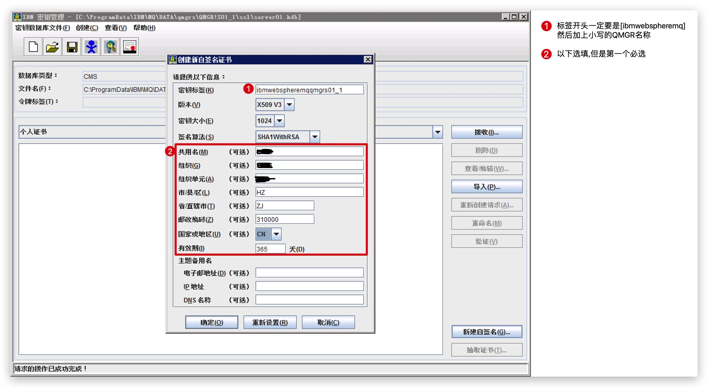
注意标签开头**ibmwebspheremq**最好是这样。
### 导出证书
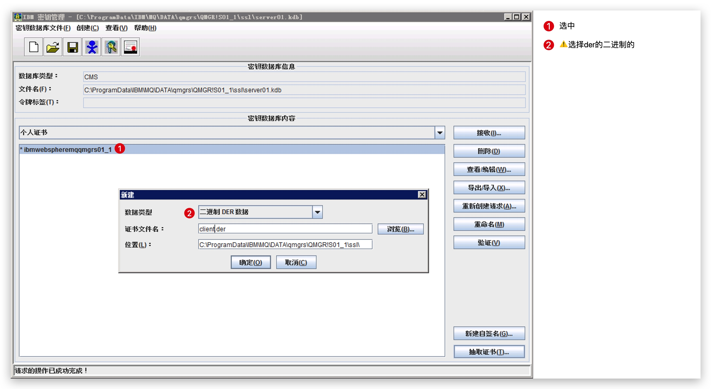
把导出的**Client.der**文件拷贝至客户机路径
### 队列管理器设置
右键需要设置**SSL**的队列管理器->属性->SSL
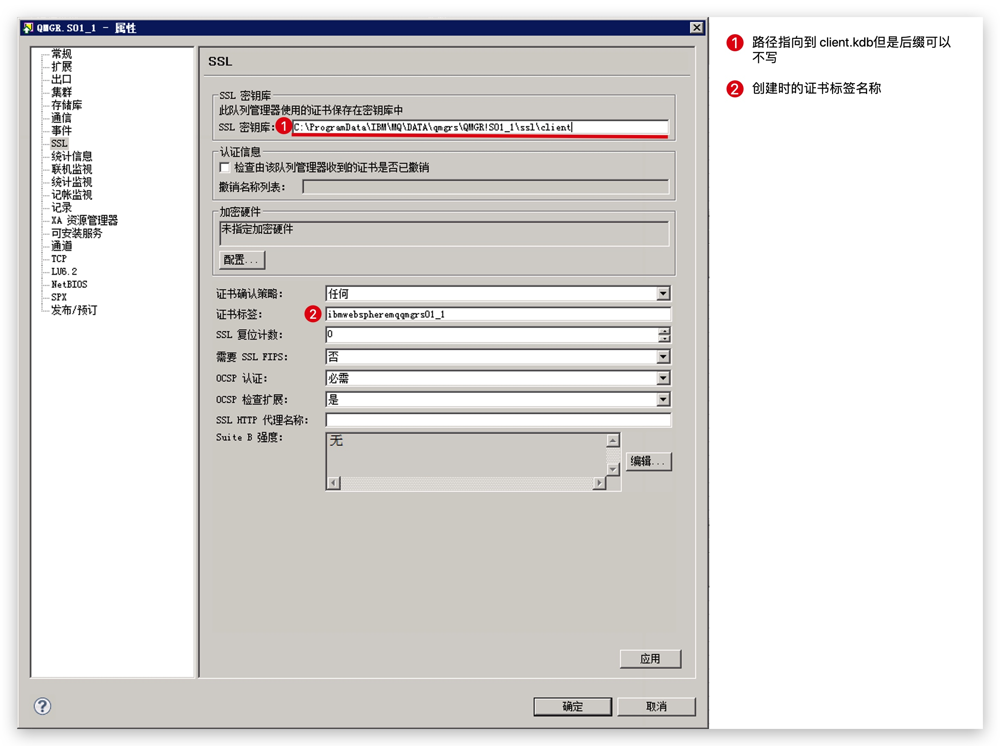
### 通道设置
进入通道,选择**服务器连接通道**双击->SSL
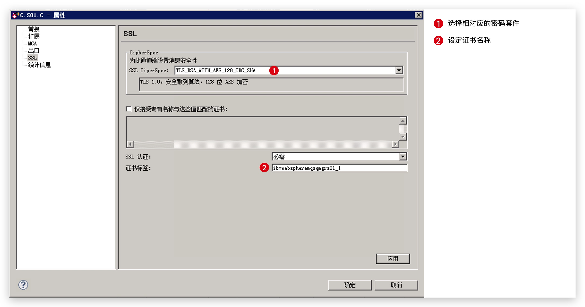
确定后刷新SSL证书
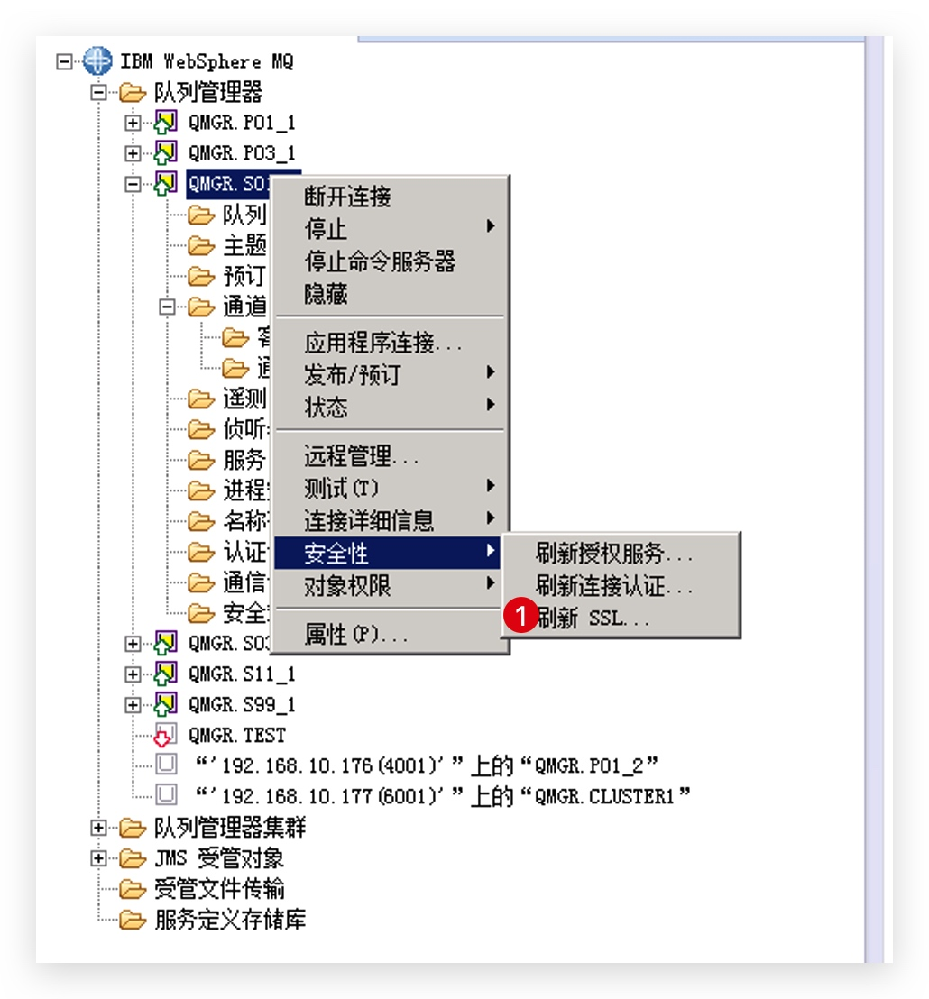
**暂时**MQ上SSL配置完成
## 客户机配置(Java)
### 信任服务器证书
找到**JVM密钥库**一般情况下会在JDK路径下`/jre/lib/security/`的**cacerts**文件.就是密钥库。
我以Mac Java1.8为例子 `/Library/Java/JavaVirtualMachines/jdk1.8.0_211.jdk/Contents/Home/jre/lib/security/cacerts`
然后找到上面**Client.der**文件,并使用**keytool**文件进行信任。
命令为:
```
keytool -import -alias s01 -keystore  /Library/Java/JavaVirtualMachines/jdk1.8.0_211.jdk/Contents/Home/jre/lib/security/cacerts -file client.der
```
|命令|内容解释|
| --- | --- |
| -alias | 相当于证书标签,建议使用队列管理器的名称 |
| -keystore | Jvm的证书库  |
| -file  | MQ导出的证书  |

**记得使用管理员权限**

**cacerts默认密码为<font size=100 color=red>changeit</font>**
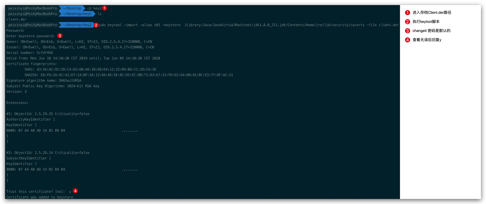

以上就信任完毕
### 创建客户机的个人证书库
使用keytool命令
```
keytool -genkeypair -keyalg RSA -keysize 1024 -sigalg MD5withRSA -validity 365 -alias clientS01 -keystore clientS01.keystore
```
|命令|内容解释|
| --- | --- |
| -alias | 相当于证书标签,建议使用队列管理器的名称 |
| -keystore | 导出证书的文件名称  |

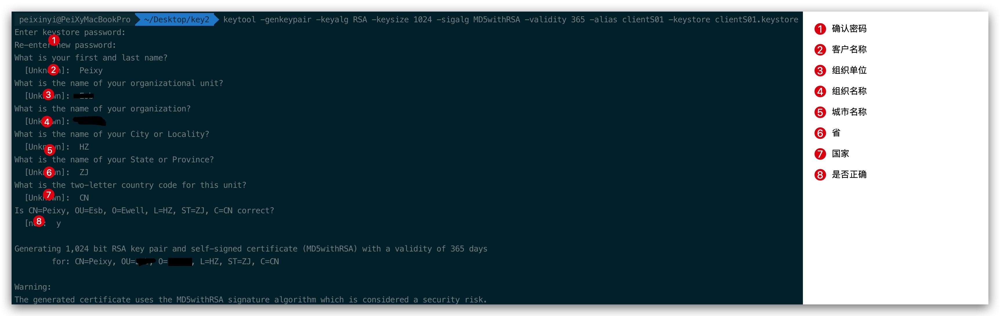

### 导出证书

```
keytool -exportcert -alias clientS01 -file clienS01.cer -keystore clientS01.keystore -rfc
```
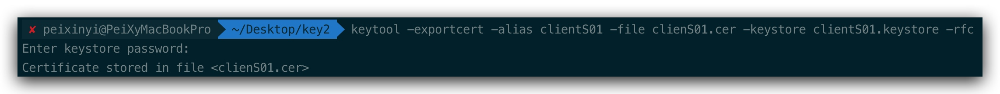

密码设置个人密钥库的密码。

## 服务器信任客户端的个人证书
拷贝**clienS01**到服务器
然后继续通过**IBM Key Management** 打开队列管理器的密钥库(\*.kdb)
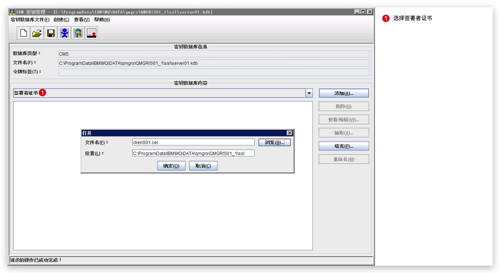
确认后添加上标签名即可。
然后再**刷新下SSL证书**
## Java连接操作
代码如下
```java
/**
 * @class MQSSL1
 * @author peixinyi
 * @date 2019-06-10 10:32
 * @describe
 */
package top.peixy.ibmmq.server;

import com.ibm.mq.*;
import top.peixy.ibmmq.entity.QueueManage;

public class MQSSL1 {


    public static void main(String[] args) {
        String channel = "C.S01.C";
        int port = 5001;
        String hostname = "192.168.10.175";
        String sslCipherSuite = "TLS_RSA_WITH_AES_128_CBC_SHA";
        String queueManageName = "QMGR.S01_1";

        QueueManage queueManage = new QueueManage(queueManageName, hostname, channel, port, sslCipherSuite);
        queueManage.setName("administrator");
        try {
            MQQueueManager queueManager = connect(queueManage);
//            sendMsg("Hello World", queueManager);
        } catch (MQException e) {
            e.printStackTrace();
        }
    }

    static MQQueueManager connect(QueueManage queueManage) throws MQException {
        //客户机的证书库
        System.setProperty("javax.net.ssl.keyStore", "/Users/peixinyi/Desktop/key2/clientS01.keystore");
        System.setProperty("javax.net.ssl.keyStorePassword", "123456");
        //JVM的证书库
        System.setProperty("javax.net.ssl.trustStore", "/Library/Java/JavaVirtualMachines/jdk1.8.0_211.jdk/Contents/Home/jre/lib/security/cacerts");
        System.setProperty("javax.net.ssl.trustStorePassword", "changeit");
        //不使用IBM的JDK
        System.setProperty("com.ibm.mq.cfg.useIBMCipherMappings", "false");
        MQEnvironment.channel = queueManage.getChannel();
        MQEnvironment.port = queueManage.getPort();
        MQEnvironment.hostname = queueManage.getIp();
        MQEnvironment.CCSID = queueManage.getCCSID();
        MQEnvironment.userID = queueManage.getName();
        MQEnvironment.sslCipherSuite = queueManage.getSslCipherSuite();
        MQQueueManager queueManager = new MQQueueManager(queueManage.getQueueManageName());
        return queueManager;
    }

    public static void sendMsg(String msgStr, MQQueueManager queueString) {
        int openOptions = MQC.MQOO_INPUT_AS_Q_DEF | MQC.MQOO_OUTPUT | MQC.MQOO_INQUIRE;
        MQQueue queue = null;
        try {
            // 建立Q1通道的连接
            queue = queueString.accessQueue("EQ.TEST", openOptions, "QMGR.S01_1", null, null);
            MQMessage msg = new MQMessage();// 要写入队列的消息
            msg.format = MQC.MQFMT_STRING;
            msg.characterSet = 1381;
            msg.encoding = 1381;
            // msg.writeObject(msgStr); //将消息写入消息对象中
            msg.writeString(msgStr);
            MQPutMessageOptions pmo = new MQPutMessageOptions();
            msg.expiry = -1; // 设置消息用不过期
            queue.put(msg, pmo);// 将消息放入队列
        } catch (Exception e) {
            // TODO Auto-generated catch block
            e.printStackTrace();
        } finally {
            if (queue != null) {
                try {
                    queue.close();
                } catch (MQException e) {
                    // TODO Auto-generated catch block
                    e.printStackTrace();
                }
            }
        }
    }
}

```